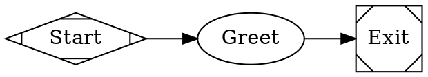

# Fabro workflows

A workflow is a **package directory**, not a single file:

```
.fabro/workflows/<name>/
├── workflow.toml      # run config: graph path, inputs, model, environment, artifacts
├── workflow.fabro     # the DOT graph (name must match [workflow].graph)
├── prompts/*.md(.j2)  # long prompts, referenced as prompt="@prompts/foo.md"
└── schemas/*.json     # JSON Schemas, referenced as output_schema="@schemas/x.json"
```

Minimal pair:

```toml
# workflow.toml
_version = 1

[workflow]
graph = "workflow.fabro"
```



## The loop

Run these in order after **every** edit. Do not skip to `fabro run`.

```bash
fabro validate .fabro/workflows/<name>/workflow.fabro   # structure, conditions, @file refs
fabro preflight .fabro/workflows/<name>/workflow.toml   # + resolves inputs/vars/model/env
fabro graph .fabro/workflows/<name>/workflow.toml -o /tmp/wf.svg   # eyeball the routing
fabro run <name> --dry-run                              # simulate execution
fabro run <name> --auto-approve -d                      # real run, detached, skip human gates
```

When a node behaves as the wrong type or an attribute seems ignored, `fabro parse <file.fabro>`
prints the parsed AST so you can see what Fabro actually inferred. It is hidden from `--help`
but present.

`--auto-approve` skips human gates; drop it when you are testing the gates themselves.
`--preserve-sandbox` keeps the sandbox alive for post-mortem `fabro sandbox ssh`.
Override inputs per-run with repeatable `-I key=value` (sparse per-key merge, unlike TOML
`[run.inputs]`, which replaces the whole map).

## Debugging a run

```bash
fabro inspect <run>          # status, current node, outcome summary
fabro events <run> -p        # pretty event log — start here; -f to follow, --since 10m
fabro logs <run> -n 200      # raw worker tracing when events aren't enough
fabro attach <run>           # live terminal view
fabro steer <run> "..."      # correct a running agent mid-execution (--interrupt to cut in)
fabro dump <run> -o ./dump   # full durable state for offline analysis
fabro fork <run>             # re-run from an earlier checkpoint after fixing the graph
```

`<run>` accepts a run ID prefix or a workflow name (resolves to its most recent run).

Read the routing decision, not just the failure: `fabro events -p` shows which edge was
selected and why. If the wrong edge was taken, the cause is almost always the
[transition cascade](REFERENCE.md#transition-cascade), not the node itself.

## Gotchas that cause most breakage

- **Templates render in exactly three attributes**: graph `goal`, node `prompt`, and the
  root `model_stylesheet`. `script` gets *value substitution only* (`{{ goal }}`,
  `{{ inputs.X }}`, `{{ vars.X }}` — no ``, no filters). Every other attribute,
  including `label`, `condition`, `model`, and all edge attributes, is **literal text**;
  `{{ }}` there produces a `detemplated_attribute` warning and silently does nothing.
- **Shape determines the handler.** Omitting `shape`/`type` gives an agent node, unless
  the node sets `script` (then: command). A prompt node *must* say `shape=tab` — agent and
  prompt take identical attributes and are otherwise indistinguishable.
- **Setting both `script` and `prompt` on one node is an error.**
- **`thread_id` requires `fidelity="full"`** — validation rejects the pair otherwise.
- **`selection="random"` cannot coexist with conditional edges** on the same node.
- **Every node named by an edge needs its own declaration**, or validation fails.
- **A failed human gate never falls through an unconditional edge.** Route it explicitly
  with `condition="outcome=failed"`.
- **`auto_status=true` is deprecated** — write `on_failure="succeed"`.
- Exactly one start (`shape=Mdiamond`) and one exit (`shape=Msquare`); all nodes must be
  reachable from start.

## Reference

Full attribute tables (node types, all node/edge/graph attributes, condition grammar,
`workflow.toml` sections, imports, stylesheets, parallel fan-out): see
[REFERENCE.md](REFERENCE.md).

Canonical in-repo examples worth copying from: `.fabro/workflows/hello` (minimal),
`.fabro/workflows/code-review` (prompts, schemas, scripts, custom environment image,
artifacts, GitHub permissions), `docs/internal/demo/*.fabro` (one pattern per file).

